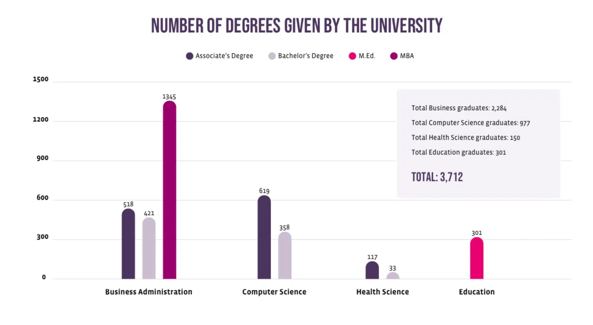

タイトルの通り、2年ほど前から通っていたUoPeopleで卒業に必要な120単位を取得でき、コンピューターサイエンスの学位を取得しました。（正確には、現在卒業証書の申請中です。）

## Summary

今改めて振り返ると、何もしないよりは通ってよかったと思いますが、卒業を待たずとも途中で大学院受験にトライすればよかったかもとも思っています。

## UoPeopleの紹介

[University of the People](https://www.uopeople.edu/) (以下UoPeople)はアメリカのオンライン大学でコンピューターサイエンスや経営学などの短期大学士、学士、修士課程を提供しています。

私が取得したコンピューターサイエンス学士の場合には、基本的に全ての授業がオンラインで完結するように設計されており、同期的なコミュニケーションを取ることなく卒業までの単位を取得することが可能です。そのため、社会人としてフルタイムで働きながら卒業することも十分に可能です。ただ、2022年9月時点で https://www.uopeople.edu/about/uopeople/fact-sheet/ （現在はリンクが切れており、https://www.uopeople.edu/about/uopeople/uopeople-data/ にリダイレクトされてしまいます）によるとUoPeopleにおいてCSの学士を取得できた人は世界でまだ358人しかいないようだったので、卒業まで継続できる人はだいぶ少ない模様でした。

私の入学経緯については、以前書いたブログに[入学経緯](https://blog.shgnkn.io/uopeople-freshman/#入学経緯)として記載があるので、そちらをご参照いただければと思います。

## UoPeopleで学んでみて

### よかった点

#### 毎週課題の期限がある

これが自分にとっては一番大きなメリットだったと思います。授業を取っていると毎週課題の期限があります。週ごとに教科書の読むページが示されており、その範囲にそったプログラミング課題やレポート、試験などが科されます。そのため、どれだけ仕事が忙しくても、プライベートの予定が入っていても強制的に課題を進める必要があり、自分に甘い僕に取ってはいい役割を果たしました。また、あまり好きではない、得意ではない科目に取り組む際にも、期限があることで気分が乗らなくても強制的に進捗を出すことができたのはよかったです。

例えば、OSなど低レイヤーの勉強をしたいと思いつつ、これまではついつい後回しにしてしまっていました。しかし、授業で締め切りに追われながら論理回路を用いてメモリを作ったり、簡易的なCPUを作ったりすることができたのでその点はとてもよかったです。また、数学における微分積分や統計学など重要性はわかるが1人ではどうしても手が進まない科目も履修できてよかったと思っています。

#### 英語力が伸びる（特に専攻分野における英語力）

アメリカの大学なので当たり前ですが、授業の教材、課題は全て英語でこなす必要があります。リーディング量だと1コース平均30ページ/週程度のリーディング課題が科されることが多かったので、2コースとっているとそれだけで60ページ程度の英語の文書を毎週読むことになります。これを2年ほど続けたことで私の英語力は格段に伸びました。特に、専攻分野における語彙に慣れたことが大きかったです。また、英語を読むこと自体を億劫に感じなくなったので、ドキュメントやブログ、本など以前は英語で書かれていると気乗りせずあまり手に取りたくなくなってしまっていた文書でも、抵抗なく英語のまま読めるようになったことはこれからキャリアを伸ばしていく上で大きなアドバンテージになったかと思います。

このおかげで、IELTSでもover all 7.5 (Speaking 7.0, Listening 8.0, Reading 9.0, Writing 6.5)を取得でき、現職でもグローバルチームで英語の環境で働くことができるようになったので、確実に効果はあったかと思います。

#### 頭の中にインデックスを貼ることができる

学部生の授業なので、１つ１つの分野については深く掘り下げるところまでは扱いません。例えば、データベースの授業をとって、データベースの特徴や構造のさわりを学んだとしても、簡易的なデータベースを実装するところまでは行いません。また、プログラミング言語の授業を取っても、コンパイラを作成するところまでは行いません。機械学習の授業を取っても、株価予測で十分なパフォーマンスが出るモデルを構築したりはしません。しかし、コンピューターサイエンスがカバーしている範囲を広く浅く触れていくので、自分がやりたいことがある際に何をより深く学んだら実現可能になるのか全体像を掴むことができました。特に、もともとはあまり興味がなかった分野で、独学で本を読むこともなかった分野についても触れることができたので、自分の興味の幅を広げることも同時にできたのがよかったです。

#### 学位が取れる

海外移住を考える際など、特にキャリアが浅く仕事の実績が薄い場合にはコンピューターサイエンスの学位を持っていることはプラスに働きます。また、もともと文系学部卒の僕としては、一応でもコンピューターサイエンスを体系的に学んで学位を持っていることでコンプレックスが多少薄れました。また逆に、学位を持っていると言っても自分が身につけることができた知識はこんなもんか。と分かったこともよかったです。これからより深く興味がある分野を勉強していくモチベーションになりました。

#### 完全オンラインで完結できる

社会人として働きながら学位を取得した場合には大きなアドバンテージになるのではないでしょうか。仕事のあと大学に通学する必要があったりするとそれだけで時間も体力も削られてしまいます。私自身、コロナ禍において仕事がほぼリモートになったことも相まって、睡眠時間を極端に削ったりすることなく卒業まで漕ぎ着けることができました。

#### 教養科目の授業をほとんど受けずに卒業できる

単位としては教養科目も全体の1/3-1/2ぐらいは取る必要があります。しかし、他大学やCourseraやSophiaなどのオンライン学習サービスからの単位移管が90単位まで可能なので、私の場合は教養科目のほとんど全てを以前通っていた大学からの単位移管で賄い、少し足りない分もオンライン学習サービスを用いて空き時間に一気に単位を取得していくことで修了しました。そのため、UoPeopleの授業はCS関連のものに集中することができてよかったです。

### よくなかった点

#### 取る必要がない（と思う）クラスも卒業には必要

課題の中には正直意味ないなーというものもあります。JoomlaというCMSでページを作ったり、SwingやJavaFXで謎のUIを作ったりといった課題はひたすらに面倒なだけでした。ネットワークのクラスもあったのですが、中身はネットワークスペシャリストを取得する際に学んだことと同等or少し簡単なぐらいだったので、復習にはなったがわざわざやらなくてもよかったなと思いました。また、最初の方にあるPythonやJavaを用いて行うプログラミングの基礎の授業も知っていることばかりでわざわざやる必要ないなと思ったりしながらやりました。このように、すでに習得しているかどうかに関わらず必要な単位は取得していく必要があるので、基礎がすでにある人の場合学ぶ内容は知っていることばかりでただ面倒なものになる可能性が高いと思います。

そのため、今振り返ると卒業を待たずに、途中で大学院受験にトライすればよかったと後悔しています。合格体験記などを探すと、コンピューターサイエンスなどの学位を持たずに、文系学部卒の方でも合格したという記事も見つかったので、自分もトライすればよかったと思っています。

#### 費用対効果があるかは人による

卒業までには120単位必要で、2023年6月現在1コース(3単位)120ドルなので、単位移行を行わない場合には合計120×40=4800ドル≒67万円必要になります。67万円あればコースでカバーされている範囲のコンピューターサイエンスの参考書や教科書を買っても十分にお釣りがきますし、より短い期間で学習を終えることができると思います。

多少勉強効率が悪くても、学位が欲しいという場合にはいい選択肢になるかと思いますが、純粋に自分の知識を増やしたいのであれば自学する方がいいと個人的には思います。

ちなみに、自分は卒業までにUoPeopleに2439ドル、その他SophiaやCoursera, Study.comなどに1000ドル程度支払ったので、合計3500ドル（1ドル140円換算で49万円）かかりました。

#### UoPeopleはRegional Accreditationの大学ではない

私も入学してからだいぶ経ってから知ったのですが、アメリカの大学には様々な認定制度があります。大きく３つの認定制度があり、それぞれRegional Accreditation, National Accreditation, Programmatic Accreditationです。UoPeopleはこの中のNational Accreditationに認定されている大学です。私の感覚としては、National Accreditationが最も権威があるのかと思っていたのですが、Regional Accreditationの方が相対的に権威があるようで、大学院などの出願条件ではRegional Accreditationを求められる場合もあります。UoPeopleも2023年6月現在Regional Accreditationとして認められるよう申請中ですが、まだ結果がでるまでは時間がかかるようです。

アメリカの大学の認定制度については、[Sayahさんのブログ](https://sayah-media.com/uopeople/the-meaning-of-accreditation-and-the-difference-between-regional-and-national/) が詳細に説明してくださっていました。

## これから

### 大学院に出願する

Georgia Tech Online Master of Science in Computer Science (OMSCS)にこの夏出願したいと思っています。現在書類の準備中です。

専攻は今の所Computing Systemsにしようかと考えています。仕事や今までの経験とは全く異なりますが、Computational Perception and Roboticsも面白そうなので少し迷っているところです。

(2023-11-14追記) [Georgia Tech Online Master of Science in Computer Scienceに進学します](https://blog.shgnkn.io/georgia-tech-omscs/) に進学が決まったことを書きました。

### 積読を消化する

積読がかなり溜まっていたので、この機会に一定消化したいと考えています。課題のリーディングぐらいのペースで読めば、月2-3冊は消化できそうなので少しづつ進めていきます。

### コードを書く時間を取る

個人プロジェクトとして作ってみたいものがあったのでスタートしようと思っています。仕事以外でガッツリコードを書く時間が今まであまり取れていなかったので楽しみです。
このブログもライブラリのアップデートが辛すぎることになっているので、一旦全部作り直そうかと思っています。