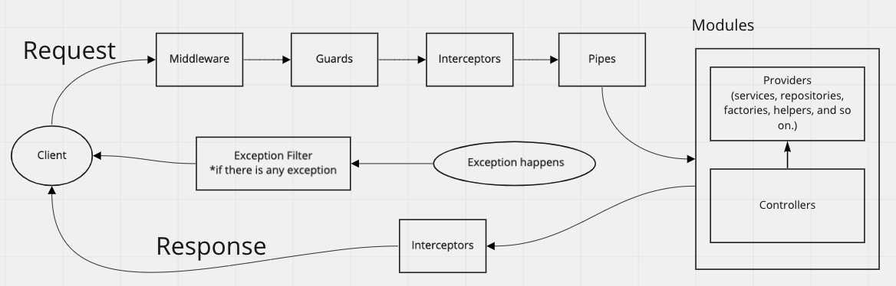

NestJS特有の概念を理解するのに最初手こずったので、備忘録を兼ねてまとめを残します。

（前回、ドメイン駆動設計入門の[読書記録](https://blog.shgnkn.io/introduction-to-ddd/)を書いた際にアプリケーションを作る中で考えたことを記事にしたいと書いていたのですが、今回はその前段階としてNestJS自体のまとめです。）

ちょうど成瀬さんの「ドメイン駆動設計入門」を読んだところだったので（読書記録は[こちら](https://blog.shgnkn.io/introduction-to-ddd/)）書籍に出てくる言葉とNestJSが扱う言葉が異なっており、1回目イントロを読んだ際にすっと理解できませんでした。また、書き出したところかなりボリューミーになってきてしまったので、今回の記事ではリクエストライフサイクル全体の流れと、簡単に役割を把握することに留めて、次回以降各個別概念の詳細に触れられたらと思います。

## NestJSの思想

Introductionを読むと、ExpressやFastifyといった、元となるフレームワークのAPIやサードパーティーライブラリ資産を活用するができるようになっているということがわかります。

[Documentation | NestJS - A progressive Node.js framework](https://docs.nestjs.com/)

JavaScriptライブラリは充実しているが、どれもアーキテクチャをサポートする機能は十分に要していないため、すぐ活用可能な形でテストしやすくスケール可能なコードを書くためのアーキテクチャをサポートすることに重点を置いたフレームワークとしてNestJSを作ったということみたいです。そのため、いつもは適当にコードを書きながらフレームワークに慣れていくことが多い自分ですが、今回はじっくりとNestJS自体の理解をしてからアプリケーションを作ってみることにしました。

## NestJSの全体感

[公式のoverview](https://docs.nestjs.com/first-steps)ひとつひとつの説明はサンプルコードもついていてわかりやすいのですが、それぞれのパートが全体の中でどんな役割を持っているものなのか。の理解がしづらく、初めて読んだ時は辛かったです。

そのため、それぞれのパートの詳細に入る前にそれぞれの概念がリクエストライフサイクル全体を通して見た時にどんな役割を担っているのかをまとめます。

データはこの順番で流れていき、それぞれのパートが順番に相応しい役割を担っているのだな。ということを理解した状態でチュートリアルを読んでいくのと、何も理解しないまま読み進めるのとでは読みやすさに雲泥の差がありました。（一発目は流れを理解しないまま読んだら全体感が一気にわからなくなってほぼ理解できなかった。。。。）

## イントロに登場するパートそれぞれの責務

### Middleware

クライアントからのリクエストを一番最初に受け付ける部分です。

ExpressのMiddlewareとほぼ同じ概念で、関数を実行したり、Request, Responseオブジェクトを操作したり、次のMiddlewareを呼び出したり、Request → Responseの一連の流れを終了させたりすることが可能です。

ロギング、リクエストパラメータの出力、リクエストヘッダーの確認などに利用します。

厳密に用途が決められているわけではないので、割となんでもできてしまいはします。

### Guards

GuardsはMiddlewareとは異なり、認証・認可周りの単一の責務だけを持ちます。

Expressでは、Middlewareが認証・認可機能を持っていました。しかし、Middlewareはnext()関数が呼ばれた後にどのハンドラが実行されるか知りませんでした。NestのGuardsだと、ExecutionContextを通して次に実行されるハンドラが何か正確に把握することができるので、Guardsでも宣言的で、より正しい処理を実行することができるようになっています。

### Interceptors

Interceptorsはリクエストの途中でも、レスポンスの途中でも活用可能です。AOP(Aspect Oriented Programming)に影響を受けており、メソッドが呼び出される前後のロジックをまとめたり、関数から返される値を変形したり、例外を変形したり、関数の振る舞いを拡張したりといった共通の処理をまとめて管理するための概念です。

### Pipes

Pipesの用途はシンプルに２点、バリデーションとデータ変形です。PipeにはParseIntなどよく使うものについてはNestJSが用意したものがいくつかあるので、まずはデフォルトで用意されたPipeを活用することができないか検討するのが良いです。Middlewareとの境界は若干曖昧なところもありますが、バリデーションやデータ変形についてはPipeに寄せると管理しやすくて良さそうです（ここの棲み分けは正直自信がないです。）

また、Pipeで例外が投げられるとその先のControllerには入ることなく処理が終了することになります。

### Modules&Controllers&Providers

この３つの概念はまとめて説明するのがわかりやすいので、今回はまとめて紹介します。

図にある通り、ModuleはあくまでもControllerとProviderをまとめた概念で、コードを管理するためのパッケージのようなものです。

Module同士が依存依存関係を持つ事もありますし、1つのModuleの中に複数のControllers, Providersを持つことも可能です。

Controllerはルーティングに責務を負っており、より細かい処理はControllerからProviderに依頼してProviderで処理をします。

そのため、Providerがビジネスロジックのメインを担うことになり、DDDでいうところのService, Repository, Factoryなどは基本的に全てProviderとして記述されることになっていきます。

### Exception filters

アプリケーション内で発生する全ての例外をキャッチするレイヤーです。例外が発生した際のハンドリングは全てException filterに記載して、クライアントに適切でわかりやすい例外を投げるようにします。

上図では真ん中に独立して記載されていますが、Exception filtersは上図の中のどこからでも呼び出される可能性があります。